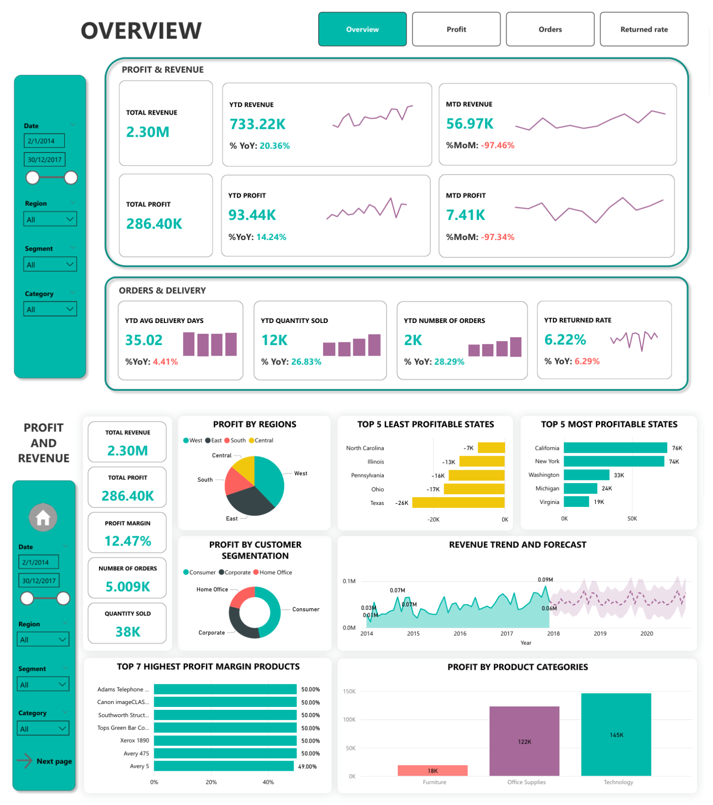
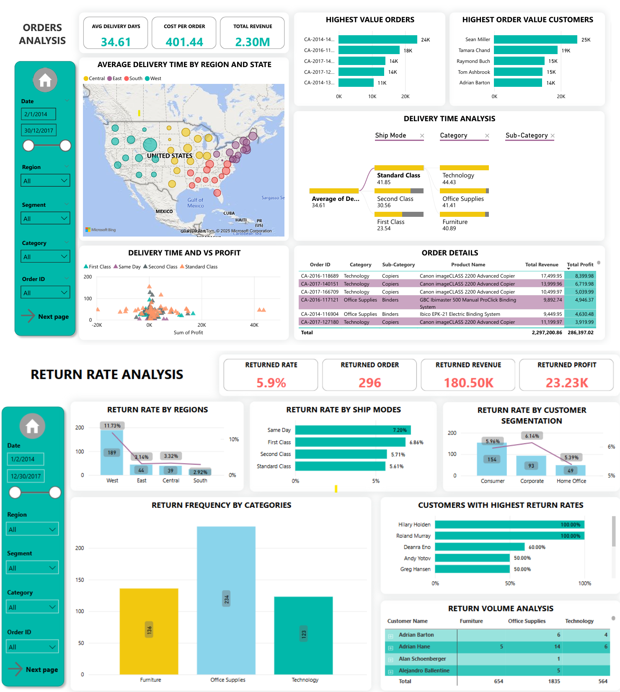

### EDUCATION
**VNU HCM - Bach Khoa University of Technology**  
Aug 2024 - Present
- Master’s Degree, Computer Science
- Cumulative GPA: 7.55/10

**VNU HCM - International University**   
September 2017 - March 2022
- Bachelor’s Degree, Food Technology
- GPA: 8.34/10  

### PROFESSIONAL EXPERIENCE

**Process Engineer (Packing) cum Project Coordinator (Customer Service & Logistics)**  
*Unilever*  
May 2023 - May 2024  
*Skills: Microsoft Power Automate, Power Query, Digital Product Development Process*  
- Maintained (daily/weekly) and further improved 3 Power BI dashboards to monitor plant’s KPIs (OEE, raw & packaging material waste, compliances (Safety, LTO audit)
- Analyzed the data from Power BI for anomalies & discussed them with operation team weekly for short and long-term actions
- Analyzed and visualized Power BI dashboard for warehouse & logistics activities (inbound & outbound truck tracking, delivery status, materials readiness)
- Input and consolidated flows of production and scheduling as requirements for development of the AI-powered production scheduling optimizer

**Management Trainee - Supply Chain (Make)**  
*Unilever*  
Apr 2022 - May 2023  
**1st rotation (4 months): Category & Customer Development - E-commerce**  
*Skills: Microsoft Excel, VBA, Microsoft PowerPoint*  
- Determined job-to-be-done for promotion gift of all categories by analyzing sell-out data from customers (Shopee, Lazada, Tiki) 
- Tracked and controlled the flow of promotion gift stock and spending for each customer and category by analyzing customers' sell-out and in-, out-bound stock reports (internal & external)
- Collaborated with CCD team to build S&OP for gift delivery to ensure lead time
  
**2nd rotation (9 months): Manufacturing Excellence - Nutrition plant**  
*Skills: Microsoft Power BI, DAX, Statistical Process Control*  
- Maintained Power BI dashboards to track manufacturing performance (savings, RPM waste and line efficiency) 
- Implemented SPC (Statistical Process Control) global app to monitor machines’ stability and reduce quality defects

**CERTIFICATES**  
   
**Supply Chain Executive Course**  
*VILAS (Vietnam Logistics and Aviation School)*   
February 2024  
[VILAS Certificate](https://bit.ly/SCE1123)  

**SQL: Advanced**  
*HackerRank*  
September 2023    
[HackerRank Certificate](https://www.hackerrank.com/certificates/ddd267bb5c50)  

**English: IELTS Academic**  
*British Council*  
November 2021  
Overall: 8.0  

# PROJECTS  
## 1. Sales and Supply Chain Analytics Dashboard - Top 14 The Analyst Challenge 2025   
The dataset, consists of 29 columns and 9994 records, provides detailed information on supply chain operations and sales
performance for a retail company. It is designed to help businesses analyze order processing, logistics, delivery performance, return rates, and customer management, enabling them to optimize supply chain efficiency and improve strategic planning.
The competitors are required to work with work with this real-world dataset on orders, customers, products, and
sales regions to uncover insights and create interactive reports using Power BI.    
This dashboard has been selected as one of top 14 in this challenge out of nearly 50 dashboards submitted to this challenge.  
**My dashboard UI:**

**Key insights from this dashboard:** [MAZ Key Insights](files/MAZ DA CHALLENGE - NDTKHANH.pdf)  
 
## 2. EDA with Python
**Conducted EDA (Exploratory Data Analysis) on 4 datasets:**

### 1. Titanic:
- **Description**: A classic dataset from the Kaggle competition, derived from passenger data on the Titanic.  
- **Contents**: Information such as passenger class, sex, age, family relations aboard, fare paid, and survival status.

### 2. VeRi776:
- **Description**: A large-scale vehicle re-identification dataset for multi-camera vehicle tracking.  
- **Contents**: 776 vehicles with over 50,000 images captured from 20 cameras, annotated with vehicle ID, camera ID, and attributes like color and type.

### 3. BBC News:
- **Description**: A text classification dataset containing news articles from the BBC across 5 categories.  
- **Contents**: 2,225 news documents labeled under categories: business, entertainment, politics, sport, and tech.

### 4. Flickr30k:
- **Description**: A large-scale image–text dataset designed for multimodal learning tasks.  
- **Contents**: 31,000 images collected from Flickr, each paired with 5 human-annotated textual descriptions.

> After EDA, machine learning/deep learning models were applied to perform classification/image retrieval (Flickr30k) tasks.

**[🔗 Link to project: EDA_Python](https://github.com/endetekaa/Python_EDA_practice)**

